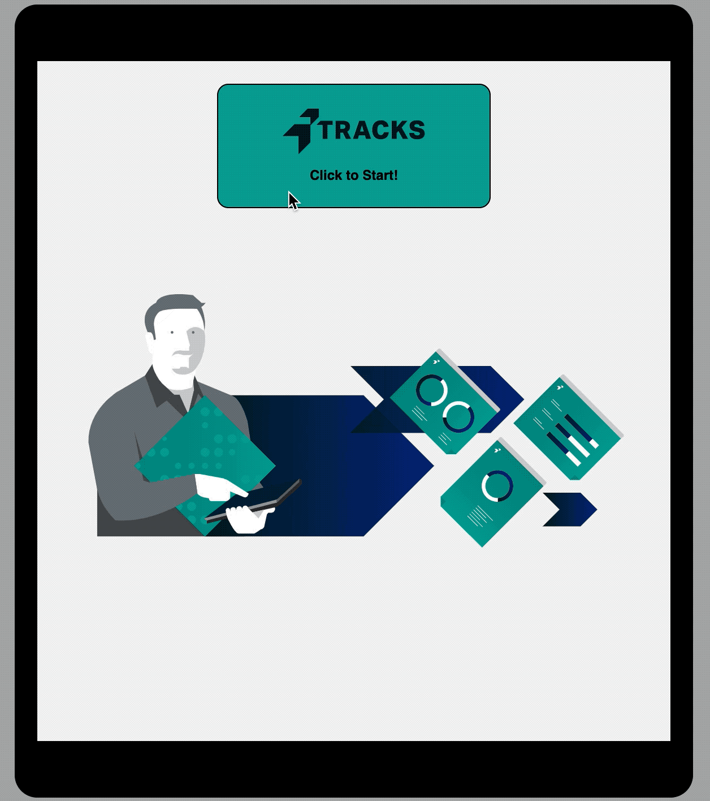
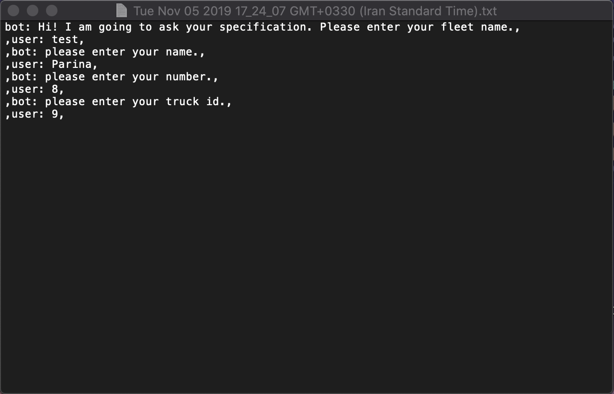

# Tracks Chat Bot

First run index.html in a browser like google chrome and then use the app as follow gif.

Chats will be saved in the text file Like the below image and the sample file is uploaded.
Tue Nov 05 2019 17_24_07.txt

